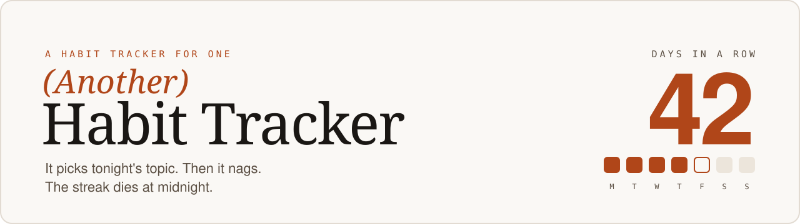
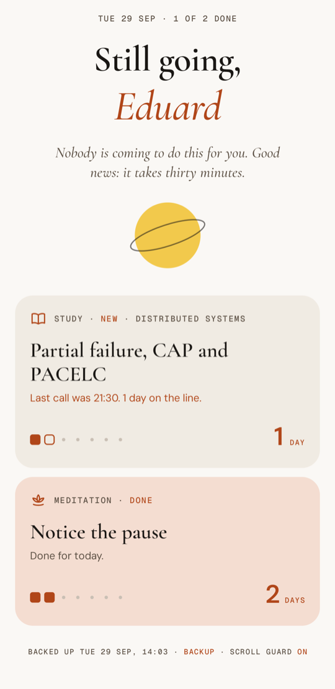
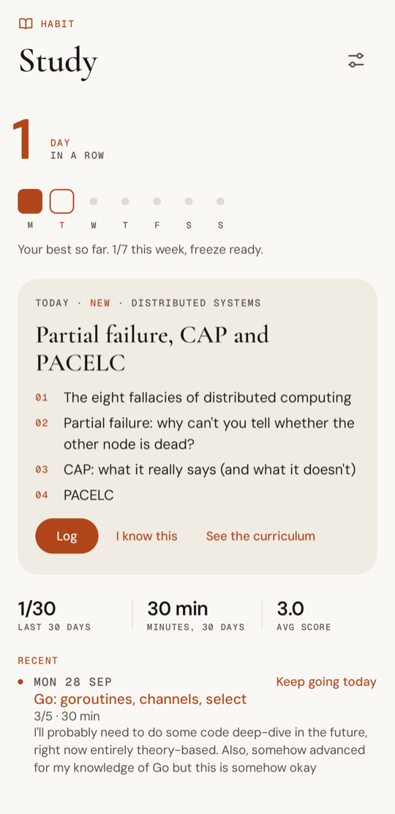
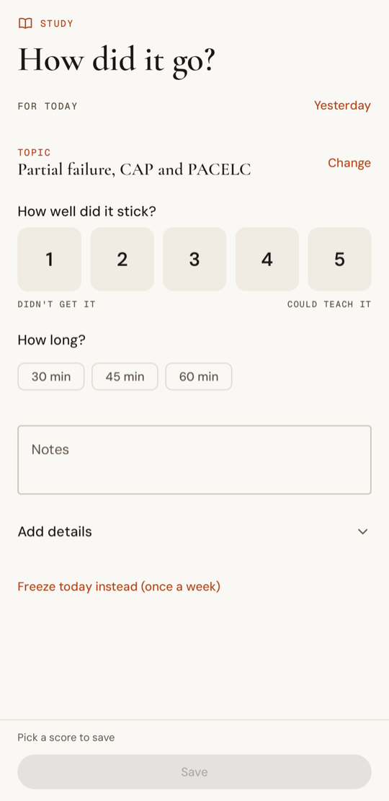
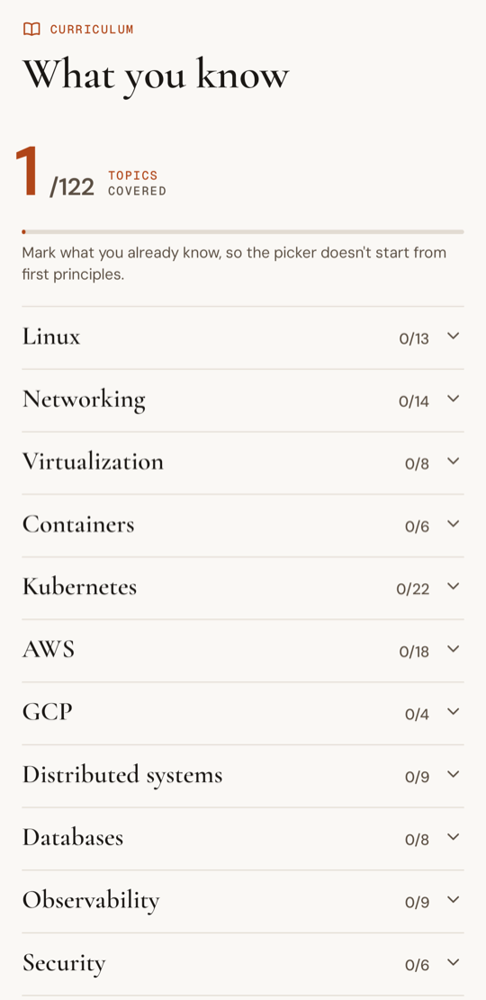
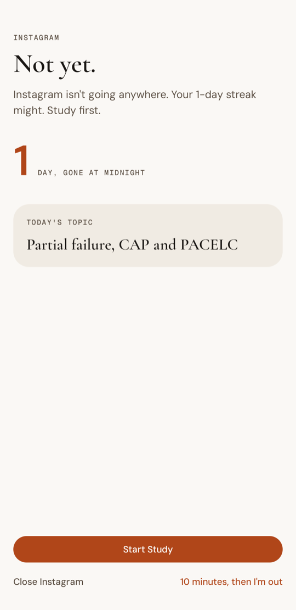

<picture>
  <source media="(prefers-color-scheme: dark)" srcset="docs/assets/banner-dark.svg">
  
</picture>

<p>
  
  
  
  
  
  <a href="https://eduarddragu.dev"></a>
</p>

**(Another) habit tracker, built for me: it picks what I study and nags me until I've done it. It blocks my doomscrolling and keeps reminding me that every day counts.**

Every habit tracker I tried would happily count my days. None of them would tell me what to study, and none of them got properly annoying late at night. So I wrote another one. The world didn't need it. I did. The studying still happens in a paper notebook. The app picks the topic, keeps asking, a little less politely each time, until the session is logged, and keeps the score.

> Built for one Pixel, installed as a sideloaded APK. The code is public; the data is not.

## Screens

Light and dark, both native. I'm biased toward the first, so that's what you get here.

<p align="center">
  
  
  
  
  
</p>
<p align="center"><sub>Home · Today's topic · How did it go? · Curriculum · Scroll guard</sub></p>

## What it does

**Picks today's topic.** No choosing, no excuses. About 120 topics sit in a prerequisite graph: Linux, networking, containers, Kubernetes, cloud, distributed systems, databases, observability, security and more (`app/src/main/assets/curriculum.json`). Each day one available topic is drawn, weighted by area, with three or four questions to work through. After the session, give it a score:

| Score | Meaning | Next |
|---|---|---|
| 1 | Didn't get it | back in 2 days |
| 2 | Partially | back in 4 days |
| 3 | Could explain the gist | opens the topics that depend on it, review in 14 days |
| 4 | Could explain it properly | review in 30 days |
| 5 | Could teach it | review in 90 days |

The log form tells you what the score will do before you save it. A topic that comes back for review shows the notes you left last time. A topic that needs more than one evening can be picked up again the next day from the session history. Already know something? Mark it known, one topic or a whole area at once (with undo), so the graph doesn't start from zero. Reviews that have come due are listed at the top of the curriculum, weakest first, and any of them can be today's topic with one tap.

Meditation gets a daily item too: one small practice for the session (a longer exhale, a body scan, noting thoughts) in three short steps. Every practice comes up once before any repeats.

**Keeps a reading list.** Reading is twenty minutes of a paper book a day. Each session is logged with the book (and its author, if you like), already filled in with the one you're on, and "Finished it" closes it. The habit's page keeps the shelf: the book in progress, since when and for how long, and every book finished, with the date and the time it took. Its daily card remembers yesterday: a book left unfinished gets a gentle push ("Atomic Habits won't finish itself."), a finished one a "What's next?".

**Gets pushier.** Each habit has its own reminder times, and each one hits harder than the last. The first sets out the day's topic. The middle ones nudge, then push. The last is a last call, with the streak on the line and its own sound. Log the habit and the rest of the day goes quiet. Weekdays and weekends can have their own times: lunch and evening during the week, when a reminder at 10:00 would just get swiped, and spread out on Saturday and Sunday.

| Reminder | Sounds like | Channel |
|---|---|---|
| First of the day | "Today: …" with the first guiding question and the streak so far | normal |
| First half | "Friendly reminder (for now): Meditation." | normal |
| Second half | "The day is getting away. Meditation first." | normal |
| Last | "Throwing away 12 days for a night on the couch? Meditation." | high priority, its own chime and a longer vibration |

From the notification you can open the log form or an app linked to the habit (a meditation app, say). Habits without a score can be marked done right there. "On it" silences the reminders in between for two hours. Not the last call, though. Nobody gets out of the last call.

**Guards the streak.** The streak is the biggest number on the screen, with this week drawn under it: on the home screen, on each habit's page and in the widget. You get one freeze a week. Log a session and today's square fills in and the number rolls over as you land back. Finished past midnight? The habit's page says "Missed yesterday" with a Log it, and the session lands on the right day, even over a freeze, which then goes back to the week. Really missed it? The week's freeze can still cover it the morning after. Any session can be edited or deleted later.

Numbers show up once there is something to count: days in the last 30, minutes, average score. After eight weeks a GitHub-style heatmap appears, shaded by score or minutes. Before that it would mostly be a grid of empty squares judging me. At 7, 30, 100 days and a few in between, the day's line gives the streak its moment. No confetti.

On Sunday evening a recap closes the week: days per habit, time, the average score, the topic that went worst.

**Opens on a planet.** Home greets you by the time of day ("Still up, Eduard?") and gives you a line for the day ("Nobody asked if you felt like it."), while a small planet sways in the middle and the habit cards wait below. Every line is written for this app; none is borrowed from a poster.

**Turns the planet into a timer.** One tap on the planet (or on the topic card) starts a session: 30 minutes for study, 5 for meditation, 20 for reading, or whatever length the habit is set to. The planet becomes the clock: the disc grows, the ring opens into a circle, and an accent arc drains as the minutes go. Under it stay the topic and its questions, so checking what's in scope never means leaving the timer. The countdown is also in the notification and in the status bar. When time's up a chime plays, the ring closes, and Log opens with the minutes already filled in.

**Takes time off with you.** Life happens. Time off covers a stretch of days, starting up to 60 days back if they've already gone, open until you're back or with an end date. Days off don't count and don't break the streak, and nothing nags: no reminders, no guard, no recap, just a kind line on the home screen. The study topic of the first day off waits for you and comes back on your return.

**Guards the feed.** Opening Instagram with the streak still open? An optional scroll guard gets there first: what's left today, the days at stake, and a button that goes straight to the habit. It's a soft block. "Ten minutes, then I'm out" lets the feed through; when they're up it asks again, a little less politely, five minutes at a time. Back takes you home instead of into the app. Once everything is logged, it steps aside. Its settings keep an honest count: how many times it stopped you this week, and how many minutes you bought. It runs as an accessibility service that only learns which app is in front, not what the apps show, and you choose the apps.

**Sits on the home screen.** A small "Today" widget shows what's done, what's left, the study topic, this week and the streaks. It follows the launcher's light or dark theme.

**Backs itself up.** All the data is one JSON file. Pick a place for it once (Google Drive works), and the app rewrites it a couple of minutes after every change and again after midnight. You can also export a copy by hand. Importing replaces everything, after a confirmation, and saves the old data first. The home screen shows when the last backup ran and warns you when it falls behind.

## Under the hood

- Kotlin, Jetpack Compose, Material 3 and Navigation 3, in the palette of [eduarddragu.dev](https://eduarddragu.dev).
- Room for storage, with every schema version exported and migrated.
- Reminders are exact alarms set on the phone (`AlarmManager`, `USE_EXACT_ALARM`), rescheduled after a reboot, an app update, or a time or timezone change. No server involved.
- Glance for the widget, refreshed on every change and just after midnight.
- Type from [eduarddragu.dev](https://eduarddragu.dev): Cormorant Garamond for titles, DM Sans for text and numbers, Geist Mono for small labels. Bundled under the SIL Open Font License and cut down to Latin characters (licenses in `app/src/main/assets/licenses/`). Habit icons are hand-drawn vectors.
- The logic that matters (streaks, time off, reminder timing and tone, heatmap, stats, topic picking and due reviews, curriculum validation, the scroll guard, the session timer, the weekly recap, the reading list) is plain Kotlin with unit tests.

```
app/src/main/java/dev/eduarddragu/anotherhabittracker/
├── domain/      pure logic: streaks, reminders, heatmap, stats, curriculum, topic picker
├── data/        Room entities and DAOs, HabitRepository
├── reminders/   alarm scheduling, receivers, notifications
├── guard/       scroll guard: accessibility service and its screen
├── backup/      JSON backup, nightly job
├── ui/          Compose screens and components
├── widget/      Glance widget
└── theme/       palette and type
```

## Build and install

You need JDK 21 (the build targets Java 17), the Android SDK (the Android CLI or Android Studio fetches the platform packages on the first build), and a phone with USB or wireless debugging on.

```bash
scripts/install.sh            # debug build, installed in place and launched
scripts/install.sh release    # release build
./gradlew testDebugUnitTest   # unit tests, on the JVM
```

### Signing

An update keeps the app's data only if it is signed with the same key as the version already installed. So the key is personal, and it stays out of the repository.

1. Create a keystore somewhere private:
   ```bash
   keytool -genkeypair -keystore ~/.android-keys/another-habit-tracker.jks -storetype PKCS12 \
     -alias another-habit-tracker -keyalg RSA -keysize 4096 -validity 36500
   ```
2. Point Gradle at it in `~/.gradle/gradle.properties` (your user-level file, not the project's):
   ```properties
   aht.storeFile=/absolute/path/to/another-habit-tracker.jks
   aht.storePassword=...
   aht.keyAlias=another-habit-tracker
   aht.keyPassword=...
   ```
3. Back up the keystore and its password. Lose them and the next version only installs after an uninstall, which deletes the data.

Without these properties the build falls back to the debug key. That's fine for trying the project, but the install script won't use it: the phone would reject the result as an update anyway.

Never run `connectedAndroidTest` against a phone you use. Instrumented tests uninstall the app when they finish, and the data goes with it.

## Privacy

The database lives on the phone. Like most Android apps, it is included in Android's own backup to your Google account. The only other copy is the backup file you pick. No accounts, no analytics, no network calls: the app doesn't even ask for internet access. The scroll guard only learns which app is in front, and keeps that on the phone. `.gitignore` keeps keystores, credentials and exports out of this repository.

## License

[GPL v3](LICENSE). Take it, change it, ship your own version, as long as yours stays open too. Either open or nothing. The bundled fonts keep their own SIL Open Font License (`app/src/main/assets/licenses/`).

---

<sub>Built by <a href="https://eduarddragu.dev">Eduard Dragu</a>. The banner, icon and palette come from the same site.</sub>
